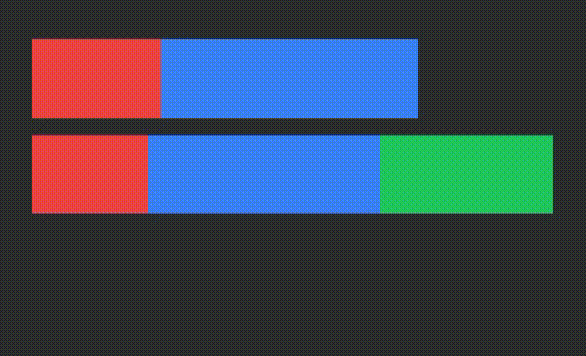

# Bevy Progressbar

[](https://opensource.org/licenses/MIT)
[](https://docs.rs/bevy-progressbar)
[](https://crates.io/crates/bevy-progressbar)
[](https://github.com/Lan-Game-Studios/bevy-progressbar/actions/workflows/rust.yml)
[](https://github.com/bevyengine/bevy/blob/main/docs/plugins_guidelines.md#main-branch-tracking)
[](https://deps.rs/repo/github/Lan-Game-Studios/bevy-progressbar)

Generate progressbars in bevy ui from simple values. 



[](https://discord.gg/JN5c3vrp) 

## TODO

- [x] optimize the image creation, by just doing one line and let the gpu use nearst neighbour to scale the texture
- [ ] (optional) render an outline of the progessbar 
- [ ] (optional) allow or rounded corners

## Features

- [x] multi section progressbars 
- [x] gpu based shader for rendering

## Install

```rust
cargo add bevy-progressbar
```

## Usage

> See examples for better understanding

```rust
fn setup(mut commands: Commands, mut materials: ResMut<Assets<ProgressBarMaterial>>) {
    let bar = ProgressBar::new(vec![(1000, Color::RED),(2000, Color::BLUE),(4000, Color::GREEN)]);
    let style = Style {
        position_type: PositionType::Absolute,
        width: Val::Px(400.0),
        height: Val::Px(200.0),
        top: Val::Px(400.0),
        ..bevy_utils::default()
    };
    commands.spawn(
        ProgressBarBundle::new(style, bar, &mut materials);
    );
}
```

| Version | Bevy Version |
|---------|--------------|
| 0.8.0   | 0.14         |
| 0.7.0   | 0.13         |
| 0.6.0   | 0.12         |
| 0.4.0   | 0.11         |
| 0.3.0   | 0.10         |
| 0.2.1   | 0.9          |

## Lan Game Studios

This crate is part of an effort to crate a game studio. Checkout 
[Mega Giga Cookie Destoryer TD](https://store.steampowered.com/app/2283070/Mega_Giga_Cookie_Destroyer_TD/) or
the mission of [Lan Game Studios](https://langamestudios.com) if you like games or game development.
